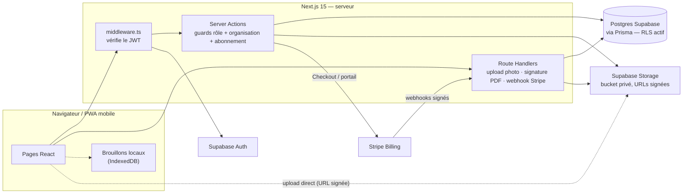

# ExtraBat

SaaS **multi-tenant** de suivi de chantier pour les entreprises du BTP spécialisées dans les sinistres humidité : du dossier client à la visite d'expert sur le terrain, jusqu'au chantier signé par le client sur le téléphone de l'ouvrier.
En production chez son premier client, l'entreprise **ISO-BAT**, avec un abonnement mensuel **Stripe**.

> **Copie de démonstration.** Ce dépôt est une copie du code d'ExtraBat préparée pour évaluation :
> - **historique git réinitialisé** (un seul commit) — le développement réel compte 266 commits depuis le 01/07/2026 ;
> - **données anonymisées** : comptes et coordonnées de démonstration, documents internes retirés ; le nom et la marque du client sont cités avec son accord ;
> - état du code : branche de développement du 27/09/2026 **+ correctifs de sécurité du 28/09/2026** (voir « Statut ») — cette copie est donc **en avance** sur la version déployée.

## Fonctionnalités

| Domaine | Ce que fait l'app | Où |
|---|---|---|
| Dossiers | Kanban des dossiers de sinistre par statut, création, doublons signalés, annulation / suppression | `app/app/dossiers/` |
| Planification | Visites planifiées par **plage horaire**, disponibilités et absences des conducteurs, conflits signalés sans blocage | `app/app/planning/`, `lib/planning.ts` |
| Terrain (conducteur) | PWA mobile : mes visites, saisie du compte-rendu avec photos, brouillon conservé localement, envoi hors ligne | `app/app/mes-visites/`, `app/app/visites/[id]/`, `lib/brouillon.ts`, `lib/sync.ts`, `app/sw.ts` |
| Compte-rendu | Compte-rendu imprimable ; classement suggéré selon le taux d'humidité, contre-visite conseillée | `app/app/visites/[id]/compte-rendu/`, `lib/metier.ts` |
| Chantiers | Planning Gantt des chantiers et des ouvriers affectés | `app/app/chantiers/`, `lib/chantiers.ts` |
| Espace ouvrier | Ses chantiers, son planning, **signature électronique** d'un PDF par le client sur le téléphone | `app/app/mes-chantiers/`, `app/app/mon-planning/`, `app/api/documents-a-signer/[id]/signer/route.ts` |
| Carte | Carte des visites (Leaflet), géocodage des adresses | `components/carte-visites.tsx`, `lib/geocodage.ts` |
| Pilotage | À traiter, historique, statistiques, finances (CA), notifications | `app/app/a-traiter/`, `app/app/statistiques/`, `app/app/finances/`, `app/app/notifications/` |
| Abonnement | Paiement mensuel Stripe (Checkout + portail client), impayé → délai de grâce → lecture seule | `app/app/parametres/abonnement/`, `lib/abonnement-stripe.ts` |

Rôles : `ADMIN`, `ASSISTANTE` (back-office), `CONDUCTEUR` (ses visites), `OUVRIER` (ses chantiers, jamais de montants).

## Stack

Next.js 15 (App Router, Server Actions) · React 19 · TypeScript · Tailwind CSS v4 · Prisma 7 (adapter `pg`) · Supabase (Postgres, Auth, Storage) · Stripe · Serwist (PWA) · pdf-lib / pdfjs-dist · Leaflet · déploiement Vercel.

## Architecture



- Toute mutation est une **Server Action** qui ouvre par un guard (rôle, organisation, abonnement) — `lib/auth.ts`.
- Stripe est la source de vérité ; la base garde un **miroir** du statut d'abonnement, alimenté par webhooks idempotents et réconcilié à l'ouverture de la page Abonnement — `lib/abonnement-stripe.ts`.
- Règles du projet et invariants : `CLAUDE.md`. Documents de conception conservés : `docs/feature-ideas/abonnement-paiement.md`, `docs/feature-ideas/comptes-ouvriers.md`.

## Sécurité

Détail avec les fichiers : **[SECURITY.md](SECURITY.md)**. En bref : inscription fermée (liste d'autorisation), guards serveur, isolation par organisation, RLS Supabase, modules secrets en `server-only`, webhooks Stripe signés et idempotents, bucket privé à URLs signées, preuve de signature (SHA-256, horodatage serveur, document signé non supprimable).

## Paiements

Un plan mensuel par organisation, dont le prix vit dans Stripe (jamais dans le code). Événements écoutés : `checkout.session.completed`, `invoice.paid`, `invoice.payment_failed`, `customer.subscription.deleted` — `app/api/stripe/webhook/route.ts`. Sans variables Stripe, l'app tourne normalement (organisations `EXONERE`).

## Installation locale

Prérequis : Node 20+, un projet Supabase (Postgres + Auth + un bucket Storage privé `sinistres`), et facultativement un compte Stripe en mode test.

```bash
npm install                 # installe et génère le client Prisma
cp .env.example .env        # puis renseigner les valeurs (voir les commentaires du fichier)
npm run db:migrate:dev      # applique les migrations
npm run db:seed             # organisation de démo + admin (+ comptes démo hors production)
npm run dev                 # http://localhost:3000
```

| Commande | Rôle |
|---|---|
| `npm run build` | `prisma generate` + `next build` : typecheck, lint et frontière client/serveur |
| `npm run lint` | ESLint |
| `npm run db:migrate` | applique les migrations (production) |

Webhooks Stripe en local : `stripe listen --forward-to localhost:3000/api/stripe/webhook`.

## Statut

- **Déployé en production** (Vercel) pour ISO-BAT : back-office, terrain conducteur, chantiers, carte, statistiques et abonnement Stripe (en place depuis juillet 2026).
- **Dans cette copie, pas encore déployés** : comptes ouvriers + signature électronique, planification par plage horaire, et les correctifs de sécurité du 28/09/2026 :
  - document signé jamais supprimable ;
  - webhooks Stripe insensibles à l'ordre de livraison ;
  - mot de passe propre à chaque ouvrier (au lieu d'un mot de passe commun) ;
  - RLS activé sur toutes les tables.
- **Ce qui manque** : tests automatisés et CI, rate limiting applicatif, CSP complète. Les correctifs du 28/09 sont vérifiés par typecheck, lint et build, pas encore exécutés contre une base.

---

Code propriétaire, tous droits réservés. Accès en lecture accordé uniquement à des fins d'évaluation.
